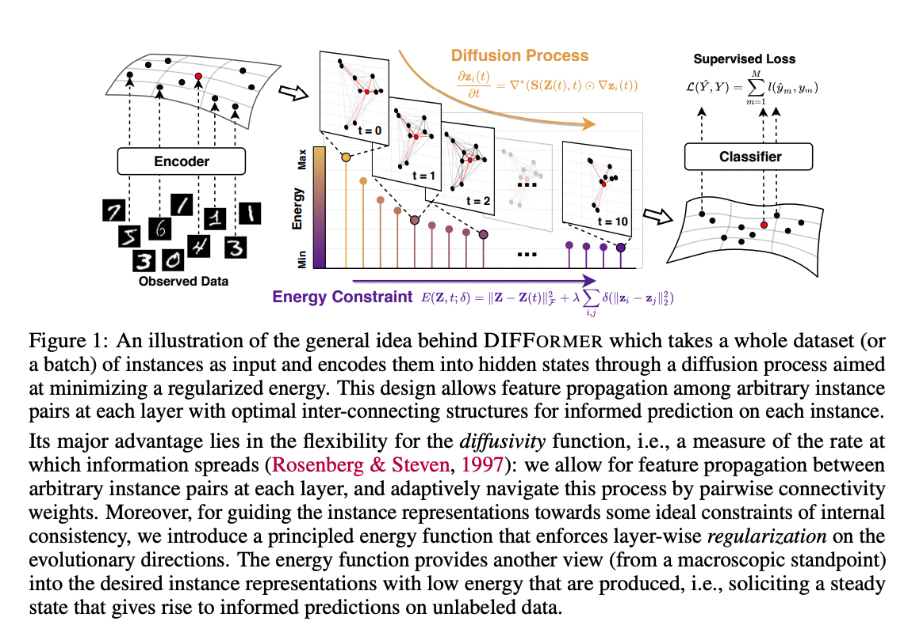

# ICLR 2023 Review on Diffusion Related Papers
Click [here](https://docs.google.com/spreadsheets/d/1WwhM-YvEBJnLk45uC_JLv2maA4tFbGwx4UYs9I2sXTY/edit?usp=sharing) to see the full list of diffusion related papers from ICLR 2023.

*Papers are listed by descending order of averaging score*
## DreamFusion
| | |
|--|--|
|Title|Dreamfusion: Text-to-3d using 2d diffusion|
|Paper Link|https://arxiv.org/pdf/2209.14988.pdf |
|Institute |Google Research, UC Berkeley|
| Authors |B Poole, A Jain, JT Barron, B Mildenhall
| Github|Not open source|

1. **Task**
	Text-to-3D synthesis
2. **Problem**
	Other works need large-scale datasets and efficient architectures for denoising 3D data
3. **Method**
	Pretrained 2D text-to-image diffusion model to perform text-to-3D synthesis. 
	Introduce a loss based on probability density distillation that enables the use of a 2D diffusion model as a prior for optimization of a parametric image generator.
4. **Performance**
	Our 3D scenes are optimized on a TPUv4 machine with 4 chips. Each chip renders a separate view and evaluates the diffusion U-Net with per-device batch size of 1. We optimize for 15,000 iterations which takes around 1.5 hours. Compute time is split evenly between rendering the NeRF and evaluating the diffusion model.
5. **Dataset**
	Training: requires no 3D training data and no modifications to the image diffusion model
	Evaluation: MS-COCO
6. **Model's information**
	Builds upon mip-NeRF 360.

  
	
Abstract and Bibtex
  
	
 
	Recent breakthroughs in text-to-image synthesis have been driven by diffusion models trained on billions of image-text pairs. Adapting this approach to 3D synthesis would require large-scale datasets of labeled 3D data and efficient architectures for denoising 3D data, neither of which currently exist. In this work, we circumvent these limitations by using a pretrained 2D text-to-image diffusion model to perform text-to-3D synthesis. We introduce a loss based on probability density distillation that enables the use of a 2D diffusion model as a prior for optimization of a parametric image generator. Using this loss in a DeepDream-like procedure, we optimize a randomly-initialized 3D model (a Neural Radiance Field, or NeRF) via gradient descent such that its 2D renderings from random angles achieve a low loss. The resulting 3D model of the given text can be viewed from any angle, relit by arbitrary illumination, or composited into any 3D environment. Our approach requires no 3D training data and no modifications to the image diffusion model, demonstrating the effectiveness of pretrained image diffusion models as priors. See dreamfusion3d.github.io for a more immersive view into our 3D results.
	
 
	
	@article{poole2022dreamfusion,
	title={Dreamfusion: Text-to-3d using 2d diffusion},
	author={Poole, Ben and Jain, Ajay and Barron, Jonathan T and Mildenhall, Ben},
	journal={arXiv preprint arXiv:2209.14988},
	year={2022}
	}

## DIFFORMER
| | |
|--|--|
|Title| Geometric Networks Induced by Energy Constrained Diffusion|
|Paper Link|https://openreview.net/pdf?id=j6zUzrapY3L |
|Institute | Anonymous authors|
| Github| Not open source|

1. **Task**
	Real-word data generation
2. **Problem**
	Complex inter-dependencies among instances involved,  a challenge for uncovering the geometric structures for learning desired instance representation. 
3. **Method**
	 Energy constrained diffusion model - it encodes a batch of instances from a dataset into evolutionary states that progressively incorporate other instances' information by their interactions.
	Propose a new class of neural encoders, Diffusion-based Transformer (DIFFORMER), with two instantiations: a simple version with linear complexity for prohibitive instance numbers, and an advanced version for learning complex structures.
4. **Performance**
	- No exactly training time specified, but DIFFORMER could use Tesla V100 16GB for mini-batch training.
	- Applicable ownstream tasks: semi-supervised node classification, image/text classification, and spatial-temporal dynamics prediction.
5. **Dataset**
	 - For node classification: Cora, Citeseer, Pubmed, Proteins, Pokec.
	 - For image and text classification: STL-10, CIFAR-10.
	 - For spatial-temperoal datasets: Chickenpox, Covid, WikiMath (all from PyTorch Geometric Temporal)
6. **Model's information**
	simple diffusivity model ( $O(NKd^2)$ ) + advanced diffusivity model ( $O(N^2Kd^2)$ )

  
	
Abstract and Bibtex
  
	
 
	  Real-world data generation often involves complex inter-dependencies among instances, violating the IID-data hypothesis of standard learning paradigms and posing a challenge for uncovering the geometric structures for learning desired instance representations. To this end, we introduce an energy constrained diffusion model which encodes a batch of instances from a dataset into evolutionary states that progressively incorporate other instances’ information by their interactions. The diffusion process is constrained by descent criteria w.r.t. a principled energy function that characterizes the global consistency of instance representations over latent structures. We provide rigorous theory that implies closed-form optimal estimates for the pairwise diffusion strength among arbitrary instance pairs, which gives rise to a new class of neural encoders, dubbed as DIFFORMER, with two instantiations: a simple version with linear complexity for prohibitive instance numbers, and an advanced version for learning complex structures. Experiments highlight the wide applicability of our model as a general-purpose encoder backbone with superior performance in various tasks, such as semi-supervised node classification, image/text classification, and spatial-temporal dynamics prediction.
	
 
	

	Currently, no BibTex provided since it is anonymous

## Template
| | |
|--|--|
|Title| |
|Paper Link| |
|Institute ||
| Github||

1. **Task**
	
2. **Problem**
	
3. **Method**
	
4. **Performance**
	
5. **Dataset**
	
6. **Model's information**
	

  
	
Abstract and Bibtex
  
	
   
	
 

