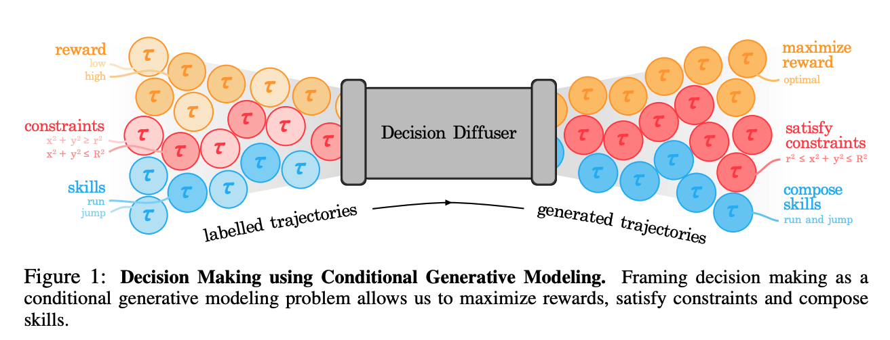

# ICLR 2023 Review on Diffusion Related Papers
Click [here](https://docs.google.com/spreadsheets/d/1WwhM-YvEBJnLk45uC_JLv2maA4tFbGwx4UYs9I2sXTY/edit?usp=sharing) to see the full list of diffusion related papers from ICLR 2023.
Click [here](https://openreview.net/group?id=ICLR.cc/2023/Conference) to see the accept papers' list of ICLR 2023.

*Papers are listed by descending order of averaging score*

# Notable Top 5%
## DreamFusion
| | |
|--|--|
|Title|Dreamfusion: Text-to-3d using 2d diffusion|
|Paper Link|https://arxiv.org/pdf/2209.14988.pdf |
|OpenReview| https://openreview.net/forum?id=FjNys5c7VyY|
|Institute |Google Research, UC Berkeley|
|Authors |Ben Poole, Ajay Jain, Jonathan T. Barron, Ben Mildenhall|
|Github|Not found official. Others: https://github.com/ashawkey/stable-dreamfusion

1. **Task**
	Text-to-3D synthesis
2. **Problem**
	Other works need large-scale datasets and efficient architectures for denoising 3D data
3. **Method**
	Pretrained 2D text-to-image diffusion model to perform text-to-3D synthesis. 
	Introduce a loss based on probability density distillation that enables the use of a 2D diffusion model as a prior for optimization of a parametric image generator.
4. **Performance**
	Our 3D scenes are optimized on a TPUv4 machine with 4 chips. Each chip renders a separate view and evaluates the diffusion U-Net with per-device batch size of 1. We optimize for 15,000 iterations which takes around 1.5 hours. Compute time is split evenly between rendering the NeRF and evaluating the diffusion model.
5. **Dataset**
	Training: requires no 3D training data and no modifications to the image diffusion model
	Evaluation: MS-COCO
6. **Model's information**
	Builds upon mip-NeRF 360.

  
	
Abstract and Bibtex
  
	
 
	Recent breakthroughs in text-to-image synthesis have been driven by diffusion models trained on billions of image-text pairs. Adapting this approach to 3D synthesis would require large-scale datasets of labeled 3D data and efficient architectures for denoising 3D data, neither of which currently exist. In this work, we circumvent these limitations by using a pretrained 2D text-to-image diffusion model to perform text-to-3D synthesis. We introduce a loss based on probability density distillation that enables the use of a 2D diffusion model as a prior for optimization of a parametric image generator. Using this loss in a DeepDream-like procedure, we optimize a randomly-initialized 3D model (a Neural Radiance Field, or NeRF) via gradient descent such that its 2D renderings from random angles achieve a low loss. The resulting 3D model of the given text can be viewed from any angle, relit by arbitrary illumination, or composited into any 3D environment. Our approach requires no 3D training data and no modifications to the image diffusion model, demonstrating the effectiveness of pretrained image diffusion models as priors. See dreamfusion3d.github.io for a more immersive view into our 3D results.
	
 
	
@misc{https://doi.org/10.48550/arxiv.2209.14988,
  doi = {10.48550/ARXIV.2209.14988},
  
  url = {https://arxiv.org/abs/2209.14988},
  
  author = {Poole, Ben and Jain, Ajay and Barron, Jonathan T. and Mildenhall, Ben},
  
  keywords = {Computer Vision and Pattern Recognition (cs.CV), Machine Learning (cs.LG), Machine Learning (stat.ML), FOS: Computer and information sciences, FOS: Computer and information sciences},
  
  title = {DreamFusion: Text-to-3D using 2D Diffusion},
  
  publisher = {arXiv},
  
  year = {2022},
  
  copyright = {arXiv.org perpetual, non-exclusive license}
}

## Sampling is as easy as learning the score

| | |
|--|--|
|Title| Sampling is as easy as learning the score: theory for diffusion models with minimal data assumptions |
|Paper Link| https://arxiv.org/abs/2209.11215 |
|OpenReview| https://openreview.net/forum?id=zyLVMgsZ0U|
|Institute | UCB, MIT, Microsoft Research, Duke University|
|Authors|Sitan Chen, Sinho Chewi, Jerry Li, Yuanzhi Li, Adil Salim, Anru R. Zhang|
|Github| Not Found|

This paper is a mathematical theory proof, so the template is not applied.
Comments from reviewers: 
`This paper derives theoretical convergence guarantees showing that diffusion models can sample from (almost) any data distribution with minimal assumptions on the underlying data distribution, and assuming that an L2-accurate score estimate is learned. Compared to prior works in this space, this submission removes restrictive assumptions that often don't apply to many real-world data distributions and it matches the complexity guarantees for the Langevin diffusion.`

  
	
Abstract and Bibtex
  
	
  
	 We provide theoretical convergence guarantees for score-based generative models (SGMs) such as denoising diffusion probabilistic models (DDPMs), which constitute the backbone of large-scale real-world generative models such as DALL⋅E 2. Our main result is that, assuming accurate score estimates, such SGMs can efficiently sample from essentially any realistic data distribution. In contrast to prior works, our results (1) hold for an L^2-accurate score estimate (rather than L^∞-accurate); (2) do not require restrictive functional inequality conditions that preclude substantial non-log-concavity; (3) scale polynomially in all relevant problem parameters; and (4) match state-of-the-art complexity guarantees for discretization of the Langevin diffusion, provided that the score error is sufficiently small. We view this as strong theoretical justification for the empirical success of SGMs. We also examine SGMs based on the critically damped Langevin diffusion (CLD). Contrary to conventional wisdom, we provide evidence that the use of the CLD does not reduce the complexity of SGMs.
	
 
@misc{https://doi.org/10.48550/arxiv.2209.11215,
  doi = {10.48550/ARXIV.2209.11215},
  
  url = {https://arxiv.org/abs/2209.11215},
  
  author = {Chen, Sitan and Chewi, Sinho and Li, Jerry and Li, Yuanzhi and Salim, Adil and Zhang, Anru R.},
  
  keywords = {Machine Learning (cs.LG), Statistics Theory (math.ST), FOS: Computer and information sciences, FOS: Computer and information sciences, FOS: Mathematics, FOS: Mathematics},
  
  title = {Sampling is as easy as learning the score: theory for diffusion models with minimal data assumptions},
  
  publisher = {arXiv},
  
  year = {2022},
  
  copyright = {arXiv.org perpetual, non-exclusive license}
}

## Decision Diffuser
| | |
|--|--|
|Title| Is Conditional Generative Modeling all you need for Decision Making? |
|Paper Link| https://arxiv.org/abs/2211.15657 |
|OpenReview| https://openreview.net/forum?id=sP1fo2K9DFG|
|Institute | Improbable AI Lab, MIT|
|Authors| Anurag Ajay, Yilun Du, Abhi Gupta, Joshua B. Tenenbaum, Tommi S. Jaakkola, Pulkit Agrawal
|Github|https://github.com/anuragajay/decision-diffuser/tree/main/code |

1. **Task**
	Investigated whether conditional diffusion models can directly address the problem of sequential decision-making.
2. **Problem**
	Sequential decision making.
3. **Method**
	Modeling a policy as return-conditional diffusion model with constraints and skills are conditioning variables. During inference, Decision Diffusion uses classifier-free guidance with low-temperature sampling to capture the best behaviors.
4. **Performance**
	Outperform existing offline RL approaches.
5. **Dataset**
	D4RL datasets, comparing with algorithms including CQL, IQL,  Trajectory Transformer, MoReL, Decision Transformer, Diffuser and CondDiffuser. Decision Diffuser plays more advantages in D4RL Kitchen tasks.
6. **Model's information**
	Unet, Guided Diffusion

  
	
Abstract and Bibtex
  
	
   Recent improvements in conditional generative modeling have made it possible to generate high-quality images from language descriptions alone. We investigate whether these methods can directly address the problem of sequential decision-making. We view decision-making not through the lens of reinforcement learning (RL), but rather through conditional generative modeling. To our surprise, we find that our formulation leads to policies that can outperform existing offline RL approaches across standard benchmarks. By modeling a policy as a return-conditional generative model, we avoid the need for dynamic programming and subsequently eliminate many of the complexities that come with traditional offline RL. We further demonstrate the advantages of modeling policies as conditional generative models by considering two other conditioning variables: constraints and skills. Conditioning on a single constraint or skill during training leads to behaviors at test-time that can satisfy several constraints together or demonstrate a composition of skills. Our results illustrate that conditional generative modeling is a powerful tool for decision-making.
	
 
	
@misc{https://doi.org/10.48550/arxiv.2211.15657,
  doi = {10.48550/ARXIV.2211.15657},
  
  url = {https://arxiv.org/abs/2211.15657},
  
  author = {Ajay, Anurag and Du, Yilun and Gupta, Abhi and Tenenbaum, Joshua and Jaakkola, Tommi and Agrawal, Pulkit},
  
  keywords = {Machine Learning (cs.LG), Artificial Intelligence (cs.AI), FOS: Computer and information sciences, FOS: Computer and information sciences},
  
  title = {Is Conditional Generative Modeling all you need for Decision-Making?},
  
  publisher = {arXiv},
  
  year = {2022},
  
  copyright = {arXiv.org perpetual, non-exclusive license}
}

# Notable Top 25% 
## DIFFormer
| | |
|--|--|
|Title| DIFFormer: Scalable (Graph) Transformers Induced by Energy Constrained Diffusion|
|Paper Link| https://arxiv.org/abs/2301.09474|
|OpenReivew| https://openreview.net/pdf?id=j6zUzrapY3L |
|Institute | Shanghai Jiao Tong University, University of Oxford, Amazon|
|Authors| Qitian Wu, Chenxiao Yang, Wentao Zhao, Yixuan He, David Wipf, Junchi Yan
|Github| Not Found|

1. **Task**
	Real-word data generation
2. **Problem**
	Complex inter-dependencies among instances involved,  a challenge for uncovering the geometric structures for learning desired instance representation. 
3. **Method**
	 Energy constrained diffusion model - it encodes a batch of instances from a dataset into evolutionary states that progressively incorporate other instances' information by their interactions.
	Propose a new class of neural encoders, Diffusion-based Transformer (DIFFORMER), with two instantiations: a simple version with linear complexity for prohibitive instance numbers, and an advanced version for learning complex structures.
4. **Performance**
	- No exactly training time specified, but DIFFORMER could use Tesla V100 16GB for mini-batch training.
	- Applicable ownstream tasks: semi-supervised node classification, image/text classification, and spatial-temporal dynamics prediction.
5. **Dataset**
	 - For node classification: Cora, Citeseer, Pubmed, Proteins, Pokec.
	 - For image and text classification: STL-10, CIFAR-10.
	 - For spatial-temperoal datasets: Chickenpox, Covid, WikiMath (all from PyTorch Geometric Temporal)
6. **Model's information**
	simple diffusivity model ( $O(NKd^2)$ ) + advanced diffusivity model ( $O(N^2Kd^2)$ )

  
	
Abstract and Bibtex
  
	
 
	  Real-world data generation often involves complex inter-dependencies among instances, violating the IID-data hypothesis of standard learning paradigms and posing a challenge for uncovering the geometric structures for learning desired instance representations. To this end, we introduce an energy constrained diffusion model which encodes a batch of instances from a dataset into evolutionary states that progressively incorporate other instances’ information by their interactions. The diffusion process is constrained by descent criteria w.r.t. a principled energy function that characterizes the global consistency of instance representations over latent structures. We provide rigorous theory that implies closed-form optimal estimates for the pairwise diffusion strength among arbitrary instance pairs, which gives rise to a new class of neural encoders, dubbed as DIFFORMER, with two instantiations: a simple version with linear complexity for prohibitive instance numbers, and an advanced version for learning complex structures. Experiments highlight the wide applicability of our model as a general-purpose encoder backbone with superior performance in various tasks, such as semi-supervised node classification, image/text classification, and spatial-temporal dynamics prediction.
	
 
@misc{https://doi.org/10.48550/arxiv.2301.09474,
  doi = {10.48550/ARXIV.2301.09474},
  
  url = {https://arxiv.org/abs/2301.09474},
  
  author = {Wu, Qitian and Yang, Chenxiao and Zhao, Wentao and He, Yixuan and Wipf, David and Yan, Junchi},
  
  keywords = {Machine Learning (cs.LG), Artificial Intelligence (cs.AI), FOS: Computer and information sciences, FOS: Computer and information sciences},
  
  title = {DIFFormer: Scalable (Graph) Transformers Induced by Energy Constrained Diffusion},
  
  publisher = {arXiv},
  
  year = {2023},
  
  copyright = {Creative Commons Attribution 4.0 International}
}

## DiffEdit
| | |
|--|--|
|Title|DiffEdit: Diffusion-based semantic image editing with mask guidance |
|Paper Link| https://arxiv.org/abs/2210.11427.pdf |
|OpenReview| https://openreview.net/forum?id=3lge0p5o-M-|
|Institute | Meta AI, Sorbonne Université|
|Authors| Guillaume Couairon, Jakob Verbeek, Holger Schwenk, Matthieu Cord
|Github| https://github.com/Xiang-cd/DiffEdit-stable-diffusion|

1. **Task**
	semantic image editing, which is an extension of image generation
2. **Problem**
	Current editing methods usually provide a mask, and not treat it as a conditional inpanting task.
3. **Method**
	Automatically generate a mask by contrasting predictions of model conditioned on different text prompts.
4. **Performance**
	edit images in ∼10 seconds on a single Quadro GP100 GPU
5. **Dataset**
	ImageNet, images generated by Imagen, COCO
6. **Model's information**
	diffusion model: Stable Diffusion 512*512; 50 steps DDIM sampling; mask is 32^2 for ImageNet, 64^2 for Imagen and COCO.
	

  
	
Abstract and Bibtex
  
	
 
Image generation has recently seen tremendous advances, with diffusion models allowing to synthesize convincing images for a large variety of text prompts. In this article, we propose DiffEdit, a method to take advantage of text-conditioned diffusion models for the task of semantic image editing, where the goal is to edit an image based on a text query. Semantic image editing is an extension of image generation, with the additional constraint that the generated image should be as similar as possible to a given input image. Current editing methods based on diffusion models usually require to provide a mask, making the task much easier by treating it as a conditional inpainting task. In contrast, our main contribution is able to automatically generate a mask highlighting regions of the input image that need to be edited, by contrasting predictions of a diffusion model conditioned on different text prompts. Moreover, we rely on latent inference to preserve content in those regions of interest and show excellent synergies with mask-based diffusion. DiffEdit achieves state-of-the-art editing performance on ImageNet. In addition, we evaluate semantic image editing in more challenging settings, using images from the COCO dataset as well as text-based generated images.
	
 
@misc{https://doi.org/10.48550/arxiv.2210.11427,
  doi = {10.48550/ARXIV.2210.11427},
  
  url = {https://arxiv.org/abs/2210.11427},
  
  author = {Couairon, Guillaume and Verbeek, Jakob and Schwenk, Holger and Cord, Matthieu},
  
  keywords = {Computer Vision and Pattern Recognition (cs.CV), FOS: Computer and information sciences, FOS: Computer and information sciences},
  
  title = {DiffEdit: Diffusion-based semantic image editing with mask guidance},
  
  publisher = {arXiv},
  
  year = {2022},
  
  copyright = {Creative Commons Attribution Non Commercial Share Alike 4.0 International}
}

## Template
| | |
|--|--|
|Title| |
|Paper Link| |
|OpenReview| |
|Institute ||
|Authors ||
|Github||

1. **Task**
	
2. **Problem**
	
3. **Method**
	
4. **Performance**
	
5. **Dataset**
	
6. **Model's information**
	

  
	
Abstract and Bibtex
  
	
   
	
 

