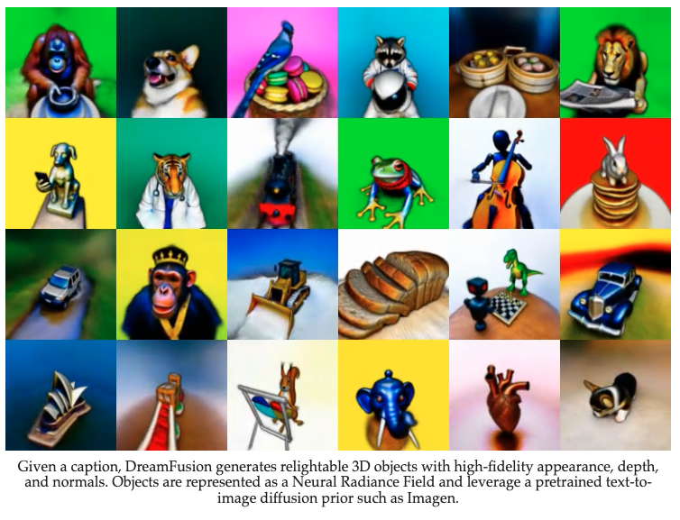
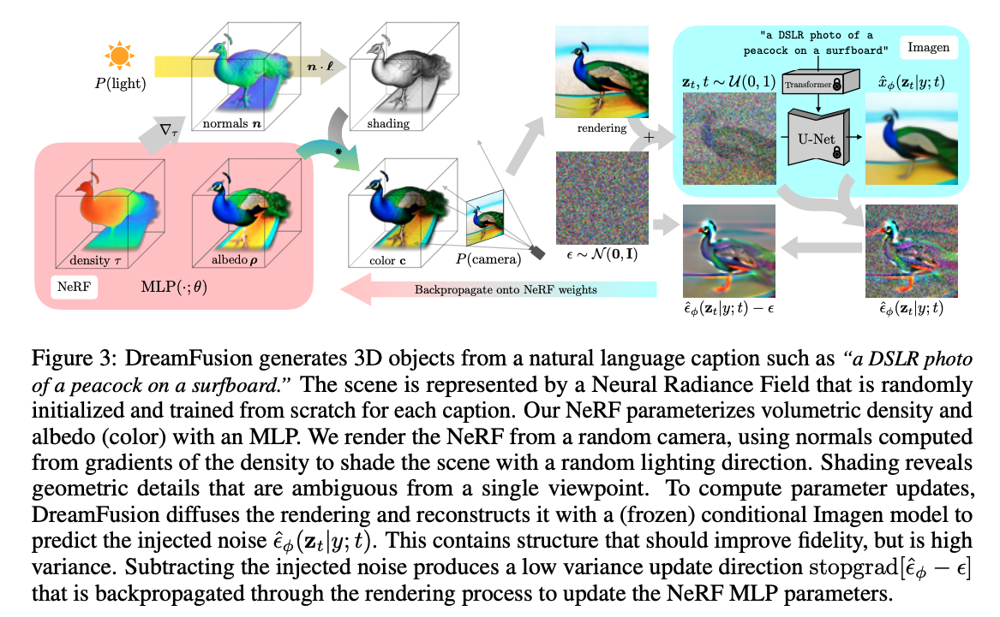

# ICLR 2023 Review on Diffusion Related Paper
## DreamFusion
| | |
|--|--|
|Title|Dreamfusion: Text-to-3d using 2d diffusion|
|Paper Link|https://arxiv.org/pdf/2209.14988.pdf |
|Institute |Google Research, UC Berkeley|
| Authors |B Poole, A Jain, JT Barron, B Mildenhall
| Github|Not open source|

1. **Task**
	text-to-3D synthesis
2. **Problem**
	large-scale datasets and efficient architectures for denoising 3D data
3. **Method**
	Pretrained 2D text-to-image diffusion model to perform text-to-3D synthesis. 
	Introduce a loss based on probability density distillation that enables the use of a 2D diffusion model as a prior for optimization of a parametric image generator.
4. **Performance**
	Our 3D scenes are optimized on a TPUv4 machine with 4 chips. Each chip renders a separate view and evaluates the diffusion U-Net with per-device batch size of 1. We optimize for 15,000 iterations which takes around 1.5 hours. Compute time is split evenly between rendering the NeRF and evaluating the diffusion model.
5. **Dataset**
	Training: requires no 3D training data and no modifications to the image diffusion model
	Evaluation: MS-COCO
6. **Model's information**
	Builds upon mip-NeRF 360.

  
	
Abstract and Bibtex
  
	
 
	Recent breakthroughs in text-to-image synthesis have been driven by diffusion models trained on billions of image-text pairs. Adapting this approach to 3D synthesis would require large-scale datasets of labeled 3D data and efficient architectures for denoising 3D data, neither of which currently exist. In this work, we circumvent these limitations by using a pretrained 2D text-to-image diffusion model to perform text-to-3D synthesis. We introduce a loss based on probability density distillation that enables the use of a 2D diffusion model as a prior for optimization of a parametric image generator. Using this loss in a DeepDream-like procedure, we optimize a randomly-initialized 3D model (a Neural Radiance Field, or NeRF) via gradient descent such that its 2D renderings from random angles achieve a low loss. The resulting 3D model of the given text can be viewed from any angle, relit by arbitrary illumination, or composited into any 3D environment. Our approach requires no 3D training data and no modifications to the image diffusion model, demonstrating the effectiveness of pretrained image diffusion models as priors. See dreamfusion3d.github.io for a more immersive view into our 3D results.
	
 
	
	<pre><code>
	@article{poole2022dreamfusion,
	title={Dreamfusion: Text-to-3d using 2d diffusion},
	author={Poole, Ben and Jain, Ajay and Barron, Jonathan T and Mildenhall, Ben},
	journal={arXiv preprint arXiv:2209.14988},
	year={2022}
	}
	</code></pre>

## Template
| | |
|--|--|
|Title| |
|Paper Link| |
|Institute ||
| Github||

1. **Task**
	
2. **Problem**
	
3. **Method**
	
4. **Performance**
	
5. **Dataset**
	
6. **Model's information**
	

  
	
Abstract and Bibtex
  
	
 
	  
	
 
	
	<pre><code>
	
	</code></pre>

