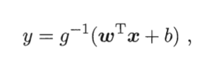

# 线性模型
## 3.1 基本形式
- linear model: a function with linear combination of features with good comprehensibility. *y = w\*x + b*
- non linear model: layer stuctures, high dimension projection.

## 3.2 线性回归
- linear regression
	- mean squred error -> least square method: attempts to find a line that minimizes the sum of the Euclidean distances from all samples to the line.
	- parameter estimition: find the solution of *w* and *b*
	- multivariate linear regression: need to calculate the inverse of matrix.
	- log-linear regression: *ln y = w\*x + b*, make *e^(w\*x+b)* closing to y.
	- generalized linear model: a link function *g()*  which is monotone and differentiable make  
-

## 3.3 对数几率回归
- logistic regression

## 3.4 线性判别估计 
- linear discriminant analysis

## 3.5 多分类学习 

## 3.6 类别不平衡问题

## 3.7 阅读材料
