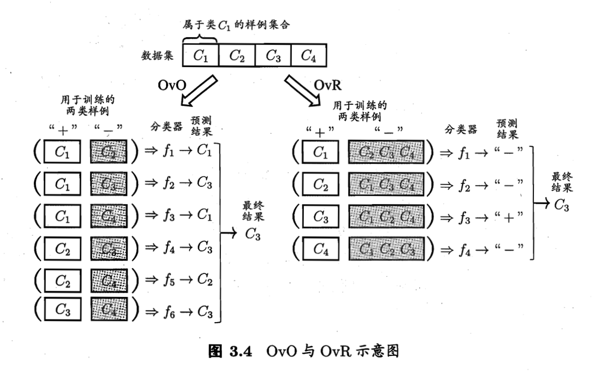

# 线性模型
## 3.1 基本形式
- linear model: a function with linear combination of features with good comprehensibility. $y = w^{T}x + b$
- non linear model: layer stuctures, high dimension projection.

## 3.2 线性回归
- linear regression
	- mean squred error -> least square method: attempts to find a line that minimizes the sum of the Euclidean distances from all samples to the line.
	- parameter estimition: find the solution of $w$ and $b$
	- multivariate linear regression: need to calculate the inverse of matrix.
	- log-linear regression: $ln_y = w^{T}x + b$,  make $e^{w^{T}x+b}$ closing to $y$.
	- generalized linear model: a link function *g()*  which is monotone and differentiable make  $y = g^{-1}(w^{T}x+b)$

## 3.3 对数几率回归
- logistic regression
	- to map the prediction from regression to classification
	- find a monitic differentiable function map from the the regresson model's preditions to lable $y$ 
	- binary classification: from continious value to {0,1}.
		- ideal: unit-step function. problem: function is not continuous, can't be $g^-()$
		- surrogate function: logistic function $y = \frac{1}{1+e^{-z}}$
		- then we get $y = \frac{1}{1+e^{-(w^{T}x+b)}}$, and $ln\frac{y}{1-y} = w^{T}x+b$.
		- odds: $\frac{y}{1-y}$ , $y$ could be seen as the probability that $x$ is positive, $1-y$ vice versa
		- log odds: $ln\frac{y}{1-y}$, also called logit
		- **maximum likelihood method **

## 3.4 线性判别估计 
- linear discriminant analysis (LDA): project the samples to a line, the samples in one calss are close to each other, vice versa. 
	- **with-in class scatter matrix**
	- **between-class scatter matrix**
	- **generalized Rayleigh quotient**
	- **LDA to multiclassification problem**

## 3.5 多分类学习 
Multiple solutions to multi-classification problem:
- decompose problem to multiple binary classification problems: depending the way of decomposing
	- **one vs one (OvO)**
	- **one vs rest (OvR)**
	
	- **many vs many (MvM)**
		- Error Correcting Output Codes (ECOC)

## 3.6 类别不平衡问题
- class imbalance
	- rescaling: unrealistic, precondition "Training set has the same data distributions with the whole data sample set" doesn't hold water.
	- undersampling: 在数据量大的那个类别上
	- oversampleing: 在数据量小的那个类别上
	- threshold-moving

## 3.7 阅读材料
- sparse representation
	- LASSO: approximate the L0 norm by L1 norm.
- Direct Acyclic Graph (ACG) in MvM
- misclassification cost
- multi-label learning