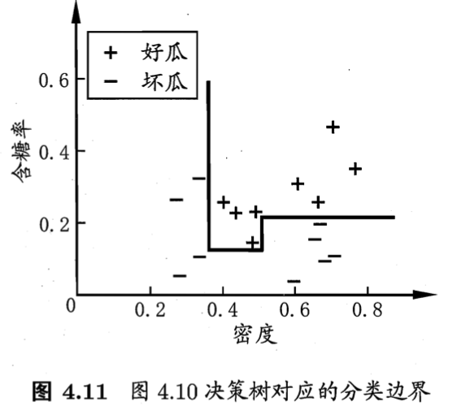
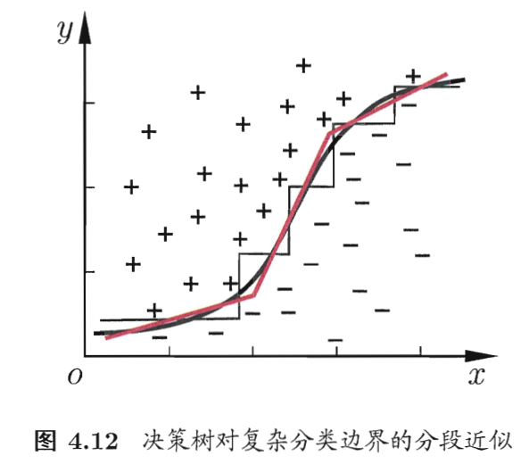

# 决策树
## 4.1 基本流程

- divide-and-conquer
	
	- end condition: （1）当前结点包含的样本都是同一个类别；（2）当前属性集为空或者所有样本属性值都一样（此时该结点的类别用后验分布）；（3）当前结点包含的样本集合为空（此时该结点的类别用先验分布）。
	
## 4.2 划分选择

The key of decision tree is Line 8 in Figure 4.2, how to select the best partition attribute $a_*$.
- information entropy: $$Ent(D) = -\sum_{k=1}^{|y|}p_k log_2{p_k}$$
	- $p_k$: the proportion of the samples belong to $k$ label in dataset $D$.
	- The bigger the entropy is, the lower purity of the dataset.
- information gain: $$Gain(D,a) = Ent(D) - \sum_{v=1}^V \frac{|D^v|}{|D|}Ent(D^v)$$
	- Arrtibute $a$  have $V$ possible values.
	- **Algorithm ID3** try to maximize information gain.
	- cons: prefer the attributes who have large number of $V$.
- gain ratio: $$Gain\_ratio(D,a) = \frac{Gain(D,a)}{IV(a)}$$ and $$IV(a) = - \sum_{v=1}^V \frac{|D^v|}{|D|} log_2 \frac{|D^v|}{|D|}$$
	- intrinsic value: $IV(a)$, the larger the $V$ is, the bigger the intrinsic value.
	- **Algorithm C4.5**: 先从候选划分属性中找出信息增益高于平均水平的属性，再从中选择增益率最高的。
- Gini index:
	- Gini: $$Gini(D)=\sum_{k=1}^{|y|} \sum_{k^\prime\neq k}p_k p_{k^\prime} = 1-\sum{k=1}{|y|}p_k^2$$
	- 从数据集D 中随机抽取两个样本，其类别标记不一致的概率
	- The bigger the Gini index is, the lower purity of the dataset.
	- Gini index : $$Gini\_index(D,a) = \sum_{v=1}^V\frac{|D^v|}{|D|}Gini(D^v)$$
	- **Algorithm CART** try to minimize the Gini index after partition.
	
## 4.3 剪枝处理
- pruning: solution to overfitting
	- prepruning: 在决策树生成过程中，对每个结点在划 分前先进行估计，若当前结点的划分不能带来决策树泛化性能提升，则停止划 分并将当前结点标记为叶结点。
		- pros: 降低过拟合风险；减少决策树训练时间开销和测试时间开销；
		- cons: 欠拟合风险。
	- post-pruning: 先从训练集生成一棵完整的决策树, 然后自底向上地对非叶结点进行考察，若将该结点对应的子树替换为叶结点能带来决策树泛化性能提升，则将该子树替换为叶结点。
		- 后剪枝决策树通常比预剪枝决策树保留了更多的分支
		- pros：欠拟合风险小
		- cons ：训练时间开销很大
	- evaluation the generalization performance: Chapter2.2
	
## 4.4 连续与缺失值
- continuous attribute:
	- bi-partition: 二分法
		- find the value $t = \frac{(a^i + a^{i+1})}{2}$, and $a^i$ is the $i$th value of continuous attribute $a$.
		- for continuous arritbute, could be reused as a node in decision tree.
		- Algorithm C4.5 using this method
- missing value:
	- two problems: 
		1. how to choose partition attribute: select the samples that have values on attribute $a$  from training data and calculate the $Gain(D,a)$
		2. given partition attribute, how to partition the data that have missing value on that attribute: 让同一个样本以不同的概率划入到不同的 子结点中去.  Algorithm C4.5 using this method.
		
## 4.5 多变量决策树
- axis parallel: 决策树所形成的分类边界有一个明显的特点: 轴平行(axis-parallel),即它的分类边界由若干个与坐标轴平行的分段组成.
	- 
- 如果使用斜的划分边界，则可以简化模型 -> multivariate decision tree 就是实现这样的“斜划分”甚至 更复杂划分的决策树。
	- 

## 4.6 阅读材料
- Decision Tree Algorithms: ID3, C4.5, CART. C4.5Rule is an algorithm that transform C4.5 decision tree to symbolic rules. Each branch of decision tree could be rewrite as a rule.
- Besides information gain, gain rate and Gini index, there are other partition's rules. However, there are experienments show that those rules have limited affects on generalization performance even they could affect the size of decision trees. Pruning have marked effect on generalization performance.
- Multivariate Decision Tree Algorithms: OC1, Boardley's algorithm, Perceptron tree, etc.
- Ingremental Learning: Adjust the model when new samples come with retraining the model.
	- algorithms: ID4, ID5R, ITI