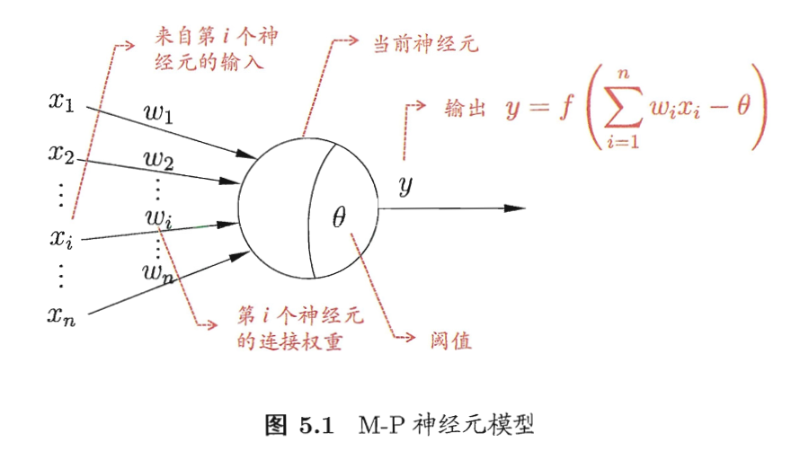
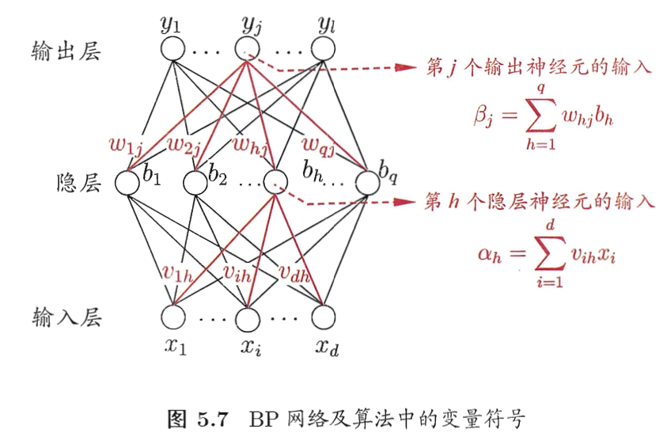
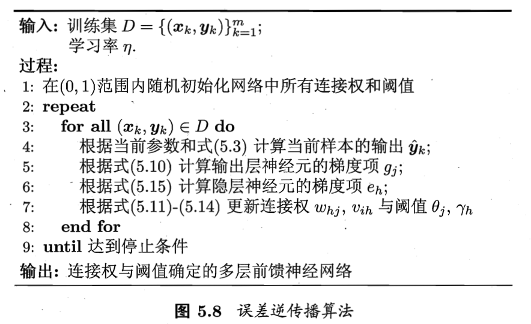
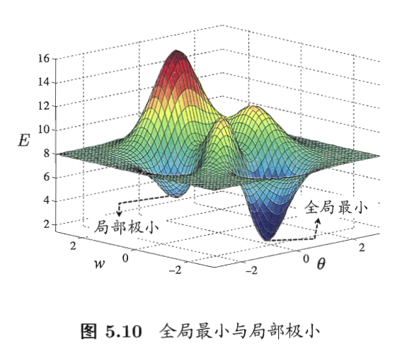

# 神经网络
## 5.1 神经元模型
- neural networks:  defination from Kohonen,1988:
```
“神经网络是由具有适应性的简单单元组成的广泛并行互连的网络，它的组织能够模拟生物神经系统对真实 世界物体所作出的交互反应" 
```
- neuron/unit : basic component of neurual networks. gets excited -> exceeds threshold/bias -> influnce neighbours 
- M-P neural model:

- activation function:
	- ideal: $sng(x) = \lbrace 0, 1 \rbrace$, but it is not differentiable.
	- sigmoid: eg, logitstic function, see Chapter3.3. Squashing input values into (0,1).
## 5.2 感知机与多层网络
- Perceptron: two layers, input layer -> output layer (M-P neuron/threshold logic unit)
	- coud represent: and, or, not
	- and, or, not -> these problems are linearly separable -> there is a hyperplane could seperate positives and negatives. -> learning procedure could converge, find a solution of $w$
	-  xor -> not linearly separable -> learning procedure could functuation, cant find a solution of $w$ -> using multi-layer neural network
	- Learning procudure: $$w_i \leftarrow w_i + \Delta w_i$$ $$\Delta w_i = \eta (y -\bar y)x_i$$ $\eta$ learning rate.
- multi-layer feedforward neural network:  input layer-> hidden layer(s) -> output layer
	- feedforward: there is no circle or loop in the topology of network.
- 神经网络的学习过程，就是根据训练数据来调整神经元之间的 “连接权”(connection weight)以及每个功能神经元的阈值; 换言之，神经网络 “学”到的东西，蕴涵在连接权与阈值中.

## 5.3 误差逆传播方法
- error backpropagation (BP)/ 反向传播算法 

	- $dq + ql + q + l$ parameters: dq+ql weights, q+l bias.
	- gradient descent (GD):
		- mean squared error for sample$(x_k, y_k)$: $E_k = \frac{1}{2}\sum_{y=1}^l(\hat y_j^k - y_j^k)$
		- $\Delta$:  
			- $\Delta w_{hj}= -\eta \frac{\partial E_k}{\partial \hat y_k^j}\frac{\partial \hat y_k^j}{\partial \beta_j} \frac{\partial \beta_j}{w_hj}$
			- $\Delta\theta_j, \Delta v_{dh}, \Delta \gamma_h$
	- 
	- goal: minimize the Error $E$ among training data D.
		- error BP & accumulated BP. Diffs like stochastic GD& GD.
		- one epoch/round: reading whole training data one time
	- The number of hidden NN: trial-by-error
	- Avoid overfitting of NN:
		- early stopping: stopping when error increases on test set while decreases on training set.
		- regularization: add extra term to objective function, describe the complixity of network, controlled by $\lambda$ (estimited by cross-validation)
		
## 5.4 全局最小与局部最小

- local minimum: multiple
- global minimum: only one
- try to find global minimum:
	- multiple init parameters -> multiple local minimums -> highly chance to get global minimum
	- simulated anealing: 模拟退火, 在每一步都以一定的概率接受比当前解更差的结果，从而有助 于 “跳出”局部极小.在每步迭代过程中，接受 “次优解”的概率要随着时间的推移而逐渐降低，从而保证算法稳定.
	- stochastic gradient descent -> get chance jump from local minimum
	- genetic algorithms
	- all algorithms above are heuristic and no theroy proof.

## 5.5 其他常见神经网络
- Radial Basis Function (RBF) network:
	- activation function for hidden neurons: radial basis function
	- output layer: linear combination of hidden neurons
- competitive learning: unsupervised learning
	- 网络的输出神经元相互竞争，每一时刻仅有一个竞 争获胜的神经元被激活，其他神经元的状态被抑制.这种机制亦称“胜者通 吃 (winner-take-all)原则.
	- Adaptive Resonance Theory (ART): incremental learning / online learning
	- ART2, FuzzyART, ARTMAP
	- Self-Organizing Map (SOM): map high dimensional input to low dims and remain their topology.
- 结构自适应网络：
	- Cascade-Correlation network: 级联相关网络
- Recurrent neural networks
	- Elman
- Energy-based model
	- Boltzmann 
	
## 5.6 深度学习
- Deep Learning:
	- more hidden layer than more hidden neurons -> BP diverge
	- pre-training -> fine-tuning 
		- eg, Deep Belief Network(DBN)
	- weight sharing: 
		- eg, CNN, same weight in different chanels.
	- Deep Learning == feature learning / representation learning 
		- feature engineering, manually
		
## 5.7 阅读材料
- Books: 
	- Haykin, S. (1998). Neural Networks: A Comprehensive Foundation
	- Bishop, C. M. (1995). Neural Networks for Pattern Recognition.
- Journals of NN: Neural Computations, Neural Networks, IEEE Transactions on Neural Networks and Learning Systems
- Conference of NN: NIPS, IJCNN, ICANN, ICONIP
- Neural network is black-box.