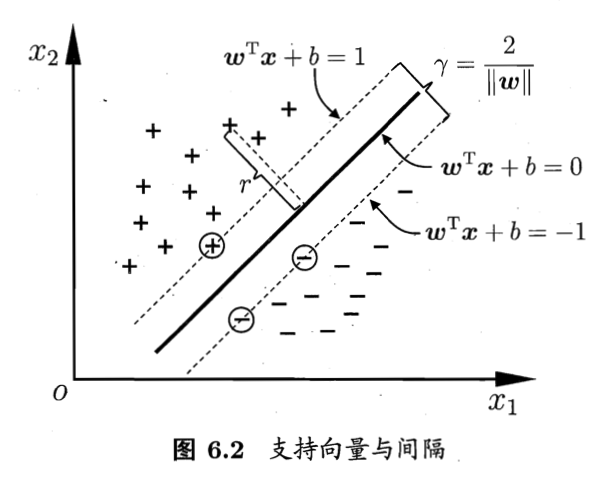
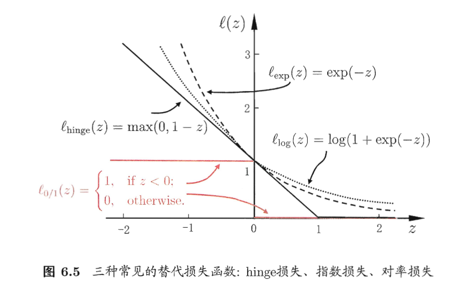
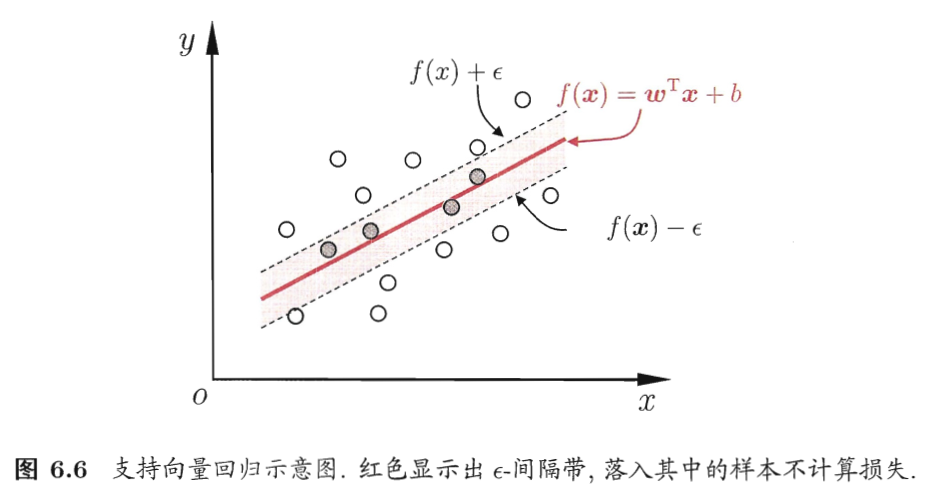
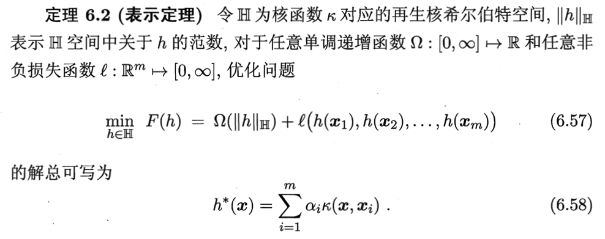

# 支持向量机

## 6.1 间隔与支持向量

- support vector
- margin
- distance from point $x$ to hyperplane: $r = \frac{|w^Tx + b|}{||w||}$
## 6.2 对偶问题
 convex quadratic programming -> dual problem
 
 Lagrange multiplier
 
Karush Kuhn Tucker

Solution: Sequential Minimal Optimization

## 6.3 核函数
Another solution: map the sample from original space to a space with higher dimension (samples could be linearly devided in this space) then find the hyperplane.

-**kernel function**: implicitly define a Reproducing Kernel Hilbert Space

-**support vector expansion** 

## 6.4 软间隔与正则化
- soft margin: allow some samples don't satisfy the constraint.
- optimization goal: minimize the number of samples that don't satisfy the constraint.
- surrogate loss: usually be convex, continuous, and the upper bound of $l_(0,1)$
	- hinge loss: could with slack variables
		- sparsity
	- exponential loss
	- logistic loss: almost could be a logistic regression model.
		- difference: logistic regression model could give probabilities while SVM have to do special ajustments to achive that; the former could be used in multi-class classification while the latter have do 推广（？

- structural risk & emperical risk
## 6.5 支持向量回归
- Support Vector Regression
- 
## 6.6 核方法
- representer theorem:
	
	- kernelized linear disceriminant analysis (KLDA)

## 6.7 阅读材料
- SVM appeared in 1995 -> statistical learning
- multiple kernel learning 
- surrogate loss ->  raise consisensy concern